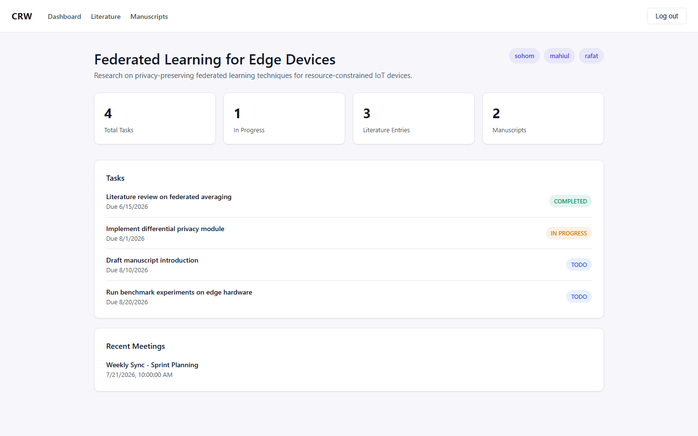
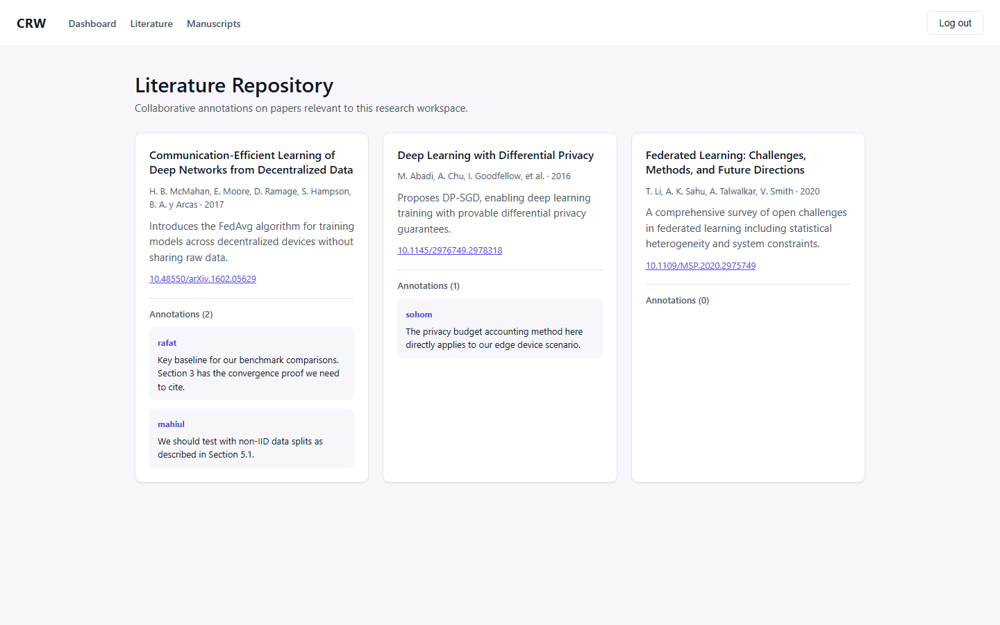
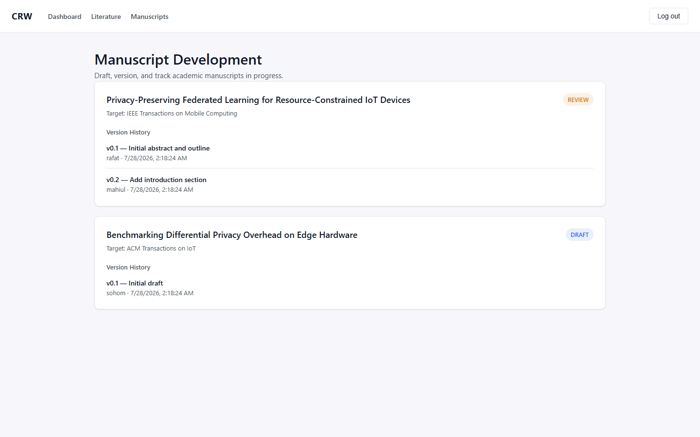

# Centralized Research Workspace (CRW)


## Project Summary

**Centralized Research Workspace (CRW)** is an all-in-one web platform built to eliminate the *"app-switching fatigue"* that academic researchers face when juggling separate tools for literature review, task management, manuscript drafting, and meeting notes.

CRW consolidates these workflows into a single collaborative workspace, allowing research teams to:

- Manage and annotate literature/paper repositories collaboratively.
- Track project tasks via **Kanban Board** or List views with member assignments and deadline tracking.
- Draft and version academic manuscripts with Markdown rendering.
- Log meeting minutes and key decisions.
- Perform **Global Search** across tasks, meetings, literature, and manuscripts.
- Manage team members and role-based permissions (`ADMIN` vs `RESEARCHER`) per workspace.
- Access dedicated **User Profile** management and activity summaries.

## Tech Stack

| Layer        | Technologies                                              |
|--------------|-------------------------------------------------------------|
| **Backend**  | Java 17+, Spring Boot 3, Spring Data JPA, Spring Security (JWT & Method Security), H2 File Database |
| **Frontend** | React.js, Vite, Axios, React Router, React Markdown        |

## Team

**Team Name:** noWayHome  
**Course:** Web Architecture - CSE 4636  

| Name              | Student ID |
|-------------------|------------|
| Rafat Abdullah    | 220041102  |
| Mahiul Kabir      | 220041109  |
| Sohom Sattyam     | 220041141  |

## Key Features Implemented

- **Authentication & Security**: JWT-based auth, password hashing, `@EnableMethodSecurity` method authorization (`@PreAuthorize("hasRole('ADMIN')")`), custom `RestAuthenticationEntryPoint` for 401 JSON error responses.
- **Workspace & Member Management**: Workspace switching, active workspace context, role-gated member management (Add / Remove member).
- **Task Tracking & Kanban Board**: Task creation, assignment to workspace members, task reassignment, list view vs **Kanban Board** with drag-and-drop status transitions.
- **Dashboard & Deadlines**: Workspace metrics, **Upcoming & Overdue** deadline panel highlighting overdue tasks and upcoming deadlines.
- **Literature Management**: Collaborative literature entry tracking with expandable annotation threads attributed to authenticated callers.
- **Manuscript Development**: Versioning history, commit messages, status tracking (`DRAFT`/`REVIEW`/`FINAL`), and Markdown preview rendering.
- **Meeting Coordination**: Meeting log entries, minutes rendered as Markdown, key decisions log.
- **Global Search**: Modal search bar accessible from any page (`Ctrl+K` / Search button) querying tasks, literature, manuscripts, and meetings.
- **User Profile**: Dedicated `/profile` page displaying user identity, role badge, joined workspaces, and assignment statistics.
- **Data Persistence**: File-based H2 storage (`jdbc:h2:file:./data/crwdb`) so data survives backend restarts.

## Features Showcase

| Dashboard | Literature Management | Manuscript Development |
|-----------|------------------------|--------------------------|
|  |  |  |

## Getting Started

### Prerequisites

- Java 17+
- Maven 3.9+
- Node.js 18+ and npm

### Backend Setup (Spring Boot)

```bash
cd CRW-backend
mvn clean install
mvn spring-boot:run
```

The backend will start on `http://localhost:8080`.

> **Note:** Data persists in `CRW-backend/data/` between restarts; delete that folder to reset to a clean database.

### Frontend Setup (React + Vite)

```bash
cd CRW-frontend
npm install
npm run dev
```

The frontend will start on `http://localhost:5173`.
